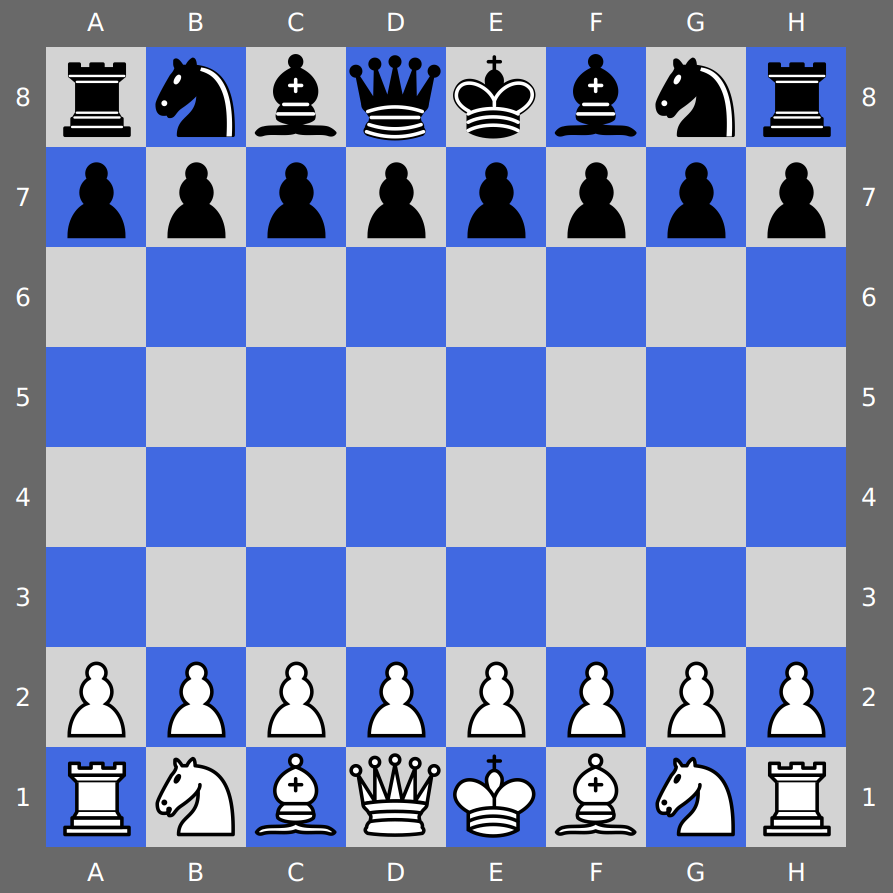

# Chess
A desktop application for playing chess locally for two players.

### Frameworks
Java, JavaFX

### Requirements
You need to have Java 13 or higher probably. Recommended: Java 15

### Running
In the project root directory run
```
./gradlew run
```

